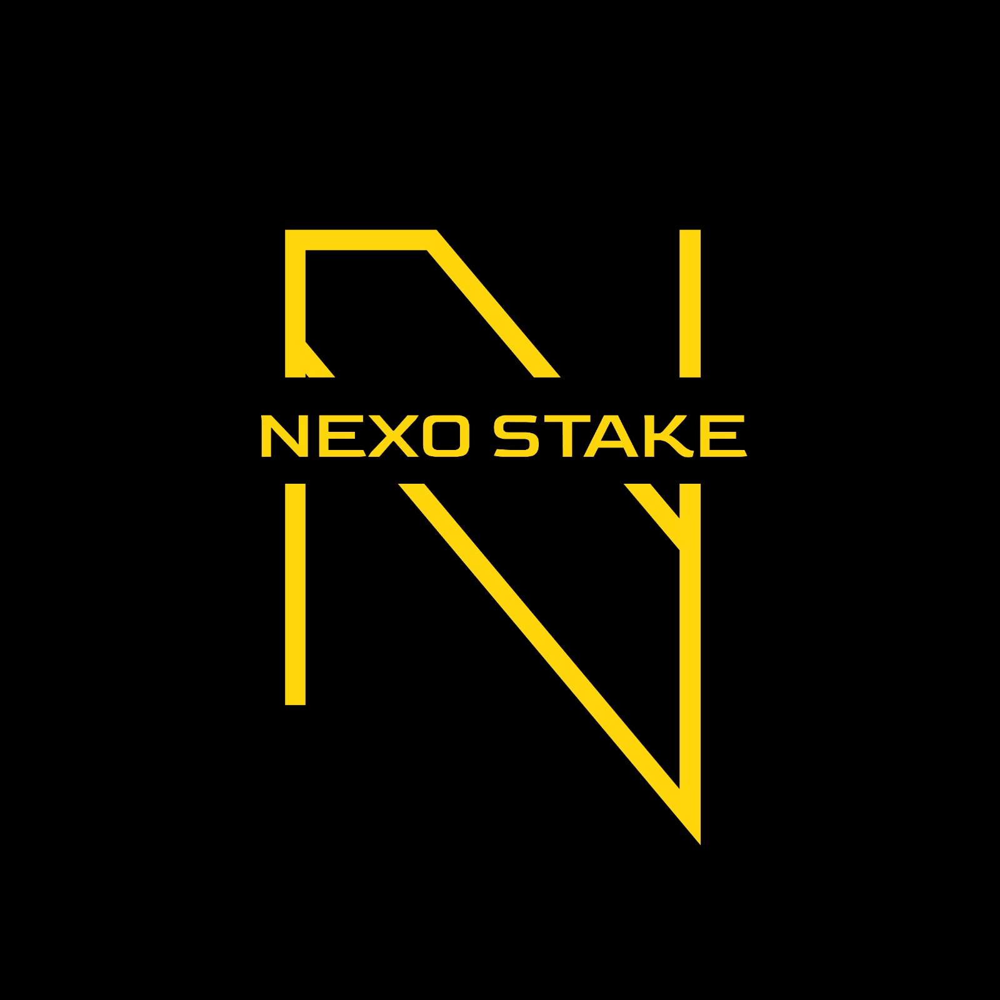
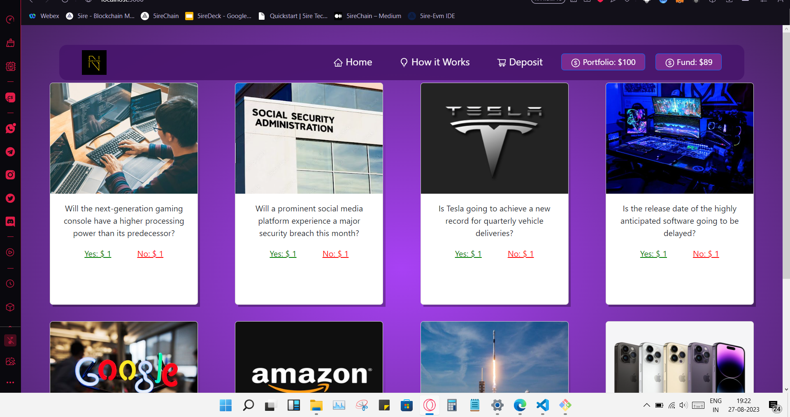

  

<h1 align="center" >NexoStake : A Decentralised future of analytical opinion trading.</h1>

  
  
  
  

# Problem Statement 🚨

Traditional betting platforms are plagued with issues such as lack of transparency, centralized control, and limited user trust. Participants often face challenges with fairness, timely payouts, and data manipulation. Moreover, legal complexities and regulatory variations hinder the industry's growth potential. There's a pressing need for a revolutionary solution that overcomes these limitations and establishes a new standard for secure and fair betting.

# Solution and Selling Points 🚀

## 1. Betting Markets 🏆

Nexo Stake reimagines betting by offering a decentralized platform where users can engage in a diverse array of betting markets. From sports events to gaming competitions and beyond, our platform empowers users to predict the outcomes of real-world events and actively participate in their predictions.

## 2. Outcome Tokens 💰

We introduce outcome tokens, bridging traditional betting and blockchain. Users leverage base tokens, such as USDC, to acquire outcome tokens representing potential event outcomes. For instance, in a football match, tokens might signify "Team A wins," "Team B wins," or "Draw."

## 3. Decentralized Exchange (DeX) 📈

Our platform features a cutting-edge decentralized exchange powered by Serum, a decentralized trading protocol. Users can trade outcome tokens, enhancing liquidity and enabling seamless buying, selling, and trading based on predictions and market dynamics.

## 4. Oracle-Driven Resolution 🔮

To guarantee the integrity of results, Nexo Stake integrates on-chain oracle data feeds. Oracles provide real-world outcome information (e.g., match results), allowing smart contracts to securely verify and determine winning outcomes.

## 5. Payouts 💸

Holders of winning outcome tokens receive payouts in base tokens, facilitated by the Aver Mint component. Users can convert these tokens back to traditional currency or continue using them for subsequent bets.

## 6. User Interfaces 👩‍💻

Nexo Stake caters to various user profiles with intuitive interfaces. Casual punters benefit from a user-friendly interface for straightforward betting, while more experienced traders access an advanced interface for intricate strategies and decentralized exchange interaction.

# Features ✨

- **Transparency and Fairness:** By utilizing blockchain and oracle technology, Nexo Stake eradicates opacity and ensures outcomes are tamper-proof and transparent.
- **Global Access:** Overcoming geographical barriers, Nexo Stake connects users from around the world, fostering a vibrant and diverse betting community.
- **Secure and Trustless:** Blockchain's immutability and decentralization guarantee trust and security, reducing the risk of data manipulation.
- **Legal Compliance:** We prioritize regulatory alignment, implementing AML, KYC, and other essential measures to ensure legal operation.
- **Premium Offerings:** Nexo Stake enriches the experience with premium features, offering advanced betting options, real-time analytics, and more to dedicated users.
- **Incentivized Oracles:** Oracles play a pivotal role, earning rewards for providing accurate and timely outcome data, reinforcing the integrity of our platform.

# Conclusion 🙌

Nexo Stake stands at the forefront of betting platform innovation, leveraging blockchain's potential to create a secure, transparent, and engaging ecosystem. By redefining user interaction, trust, and integrity, we empower individuals to confidently engage in predictions, transforming the betting landscape into one of fairness, inclusivity, and opportunity. Join us in shaping the future of betting with Nexo Stake. 🙏

# Contact Us 📞

- [Siddhartha Bhattacharjee](https://siddhartha-portfolio.vercel.app/)
- [Prayasu Satapathy](https://linktr.ee/prayasu)
- [Arun Jangra](https://arunjangra.vercel.app/)
- [Aryan Suresh Reddy ](https://github.com/Aryanreddy3)
